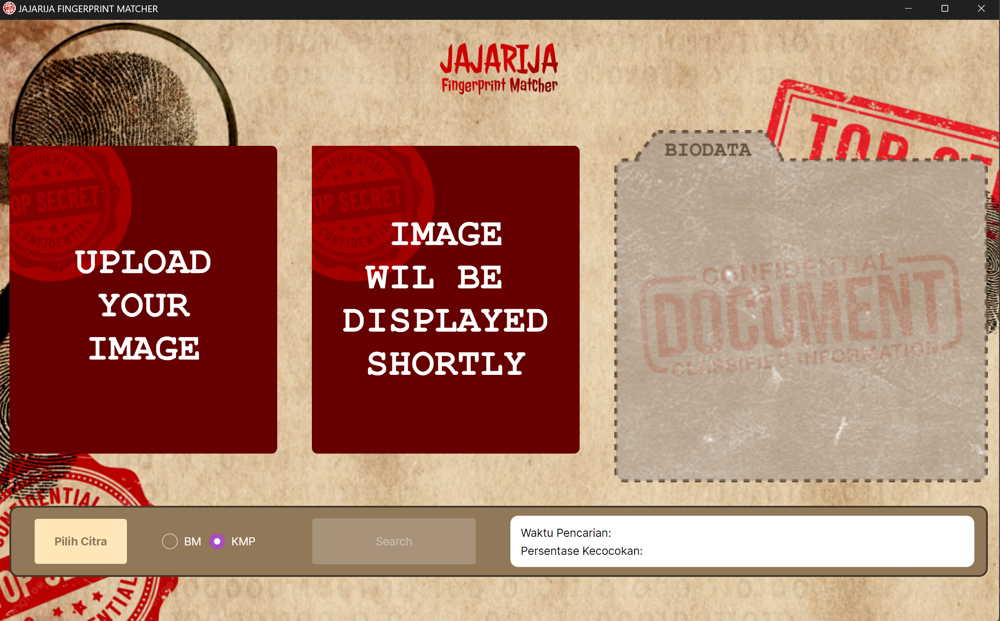
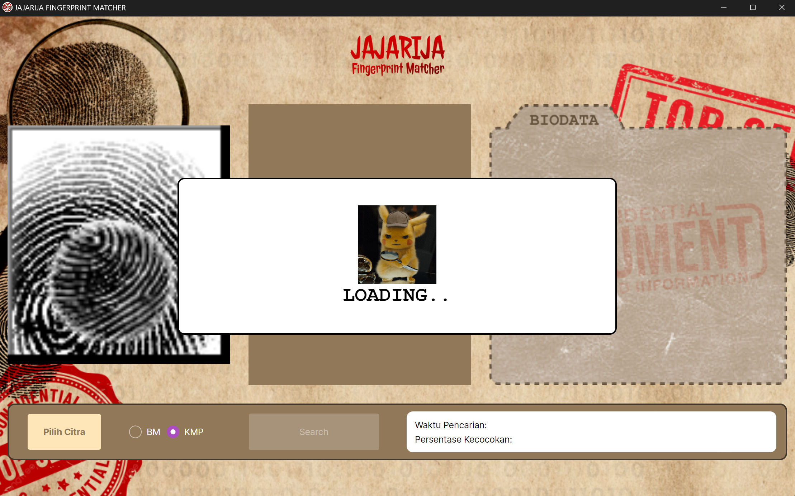
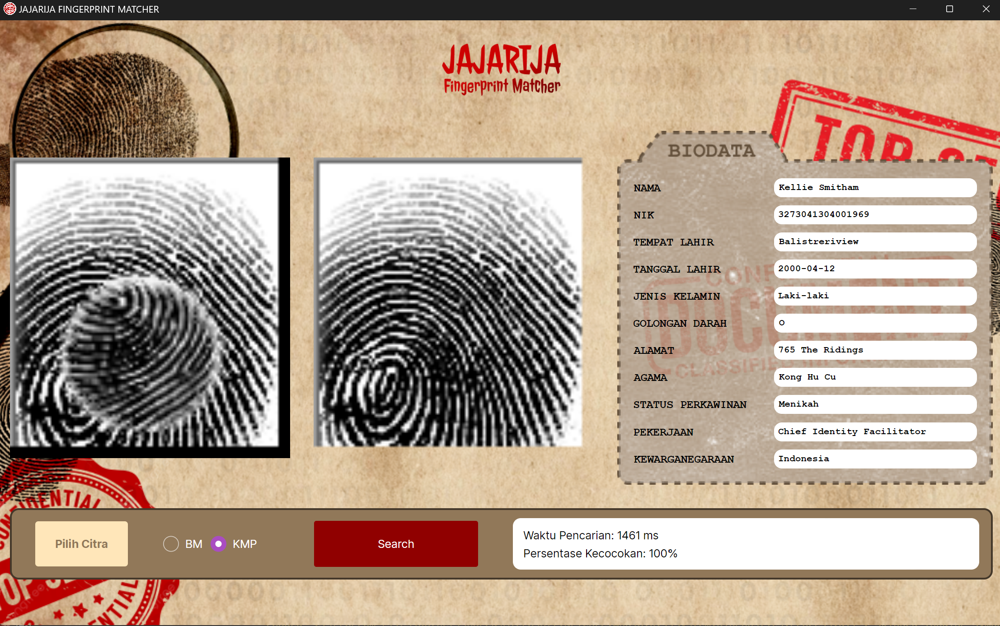

## Jajarija Fingerprint Matcher

- This C# app was created by Team Jajarija, consisting of Angie, Nuel, and Amel, as part of our third major assignment for the Algorithm Strategies course. The app implements the Boyer Moore and Knuth-Morris-Pratt (KMP) algorithm to find the best match of an altered fingerprint image from some databases. We hope you enjoy exploring it!

## Table of Contents

- [Knuth-Morris-Pratt (KMP)](#knuth-morris-pratt-kmp)
- [Boyer Moore (BM)](#boyer-moore-bm)
- [Regular Expression](#regular-expression)
- [Technologies Used](#technologies-used)
- [Program Requirement](#program-requirement)
- [Steps to Run](#steps-to-run)
- [Preview](#preview)
- [Author](#author)

## Knuth Morris Pratt (KMP)

To locate patterns in a text, one effective string searching method is the Knuth-Morris-Pratt (KMP) algorithm. In order to prevent unnecessary comparisons of characters that are already known to match or mismatch, it makes use of information from the pattern itself. When a mismatch occurs, KMP creates a "prefix function" table that assists in ignoring a certain number of characters in the text, hence lowering the overall number of comparisons required. The KMP algorithm has an O(N + M) time complexity, where N is the text's length and M is the pattern's length.

## Boyer Moore (BM)

The Boyer-Moore (BM) algorithm is a highly efficient string searching algorithm used to find occurrences of a pattern within a text. It works by preprocessing the pattern to create two heuristics: the bad character rule and the good suffix rule. The bad character rule allows the algorithm to skip sections of the text based on the presence of mismatched characters, while the good suffix rule allows it to skip sections based on matching suffixes of the pattern. This enables BM to skip large portions of the text, making it particularly fast for large alphabets. The best-case time complexity of BM is O(N/M), while the worst-case time complexity is O(N \* M), where N is the length of the text and M is the length of the pattern.

## Regular Expression

To handle the alay version in this assignment, we use a series of regular expressions in the AlayMatcher class. First, both the original and alay strings are converted to lowercase to ensure case insensitivity. Second, all spaces are removed from both strings. Third, vowels in the original string are made optional using regex patterns, allowing for their absence in the alay string. Fourth, specific characters in the original string are replaced with regex patterns to account for common alay substitutions, such as 'a' being replaced by '[a@4]' and 'i' by '[i1!]'. Fifth, a regex pattern is constructed from the modified original string. Finally, this pattern is used to check if the alay string matches, ensuring that common transformations in alay writing are accurately captured.

## Technologies Used

- Avalonia - version 11.0.10
- Mariadb - version 11 +
- .NET - version 8.0
- MySql.Data version 8.4.0
- DotNetEnv - version 3.0.0

## Program Requirement

- C#
- Avalonia
- .NET

# Steps to Run

Before running, make sure to make the database first in your local database using any sqldump and have all the nessecary requirement installed.

## Step 1: Clone this Repository

```bash
git clone https://github.com/angiekierra/Tubes3_jajarija.git
```

## Step 2: Create the .env file in the root directory

```bash
cd TUBES3_Jajarija
```

Use the following format for your .env

```bash
DB_HOST=localhost
DB_USER=root
DB_PASSWORD=<yourdatabasepassword>
DB_DATABASE=<yourdatabasename>
```

## Step 3: Encrpyt your databse (optional)

```bash
cd Converter
dotnet run
```

## Step 4: Install the nessecary package

```bash
// Navigate to src directory
cd ../src
dotnet restore
```

## Step 5: Build and run the App

```bash
dotnet build
dotnet run
```

## Preview

### Splash Screen


### Main View



### Loading View



### Result View



## Author

Created by:

| Name                          | NIM      | Contact                     | Github                                        |
| ----------------------------- | -------- | --------------------------- | --------------------------------------------- |
| Amalia Putri                  | 13522042 | 13522042@std.stei.itb.ac.id | [amaliap21](https://github.com/amaliap21)     |
| Angelica Kierra Ninta Gurning | 13522048 | 13522048@std.stei.itb.ac.id | [angiekierra](https://github.com/angiekierra) |
| Imanuel Sebastian Girsang     | 13522058 | 13522058@std.stei.itb.ac.id | [ImanuelSG](https://github.com/ImanuelSG)     |
